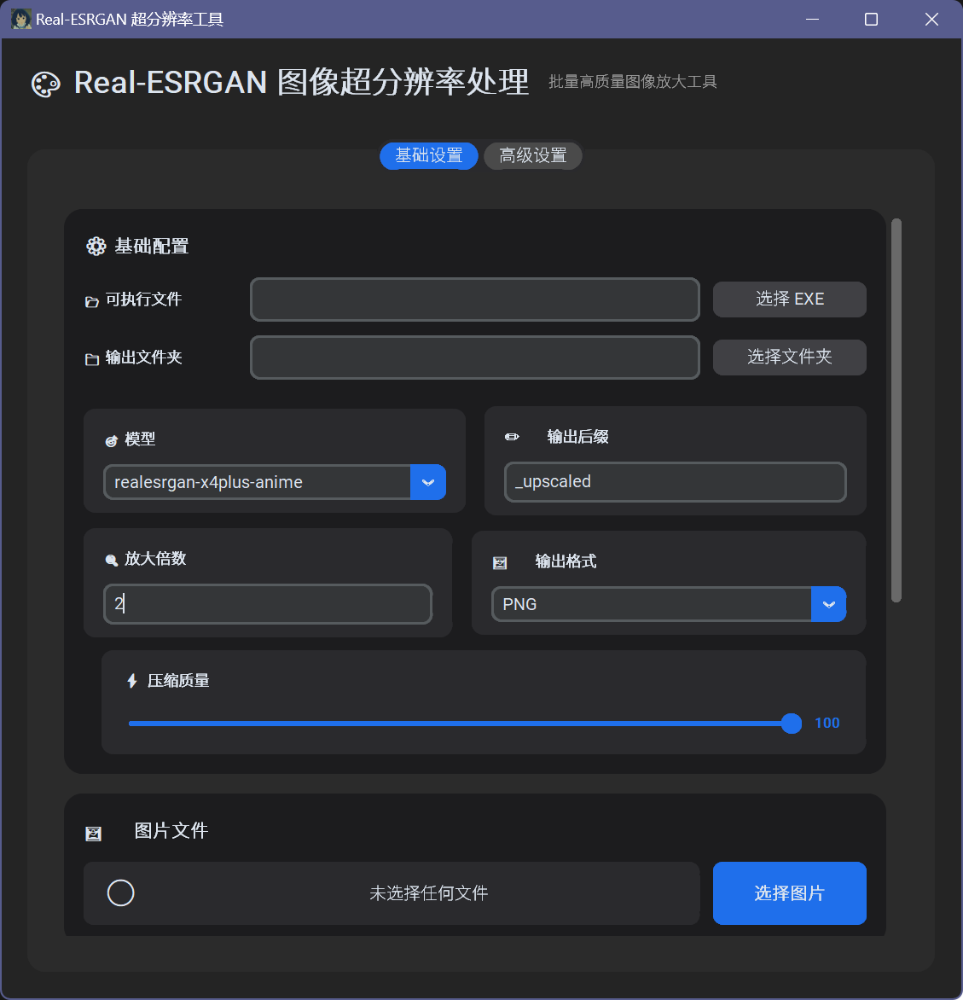

---

# 一个简易的 Real-ESRGAN GUI 工具 🖼️

一个用于 `realesrgan-ncnn-vulkan.exe` 的图形化批量处理工具。

---

### 🤔 为什么又造一个轮子？

市面上已经有很多现成的GUI，为何还要再造一个？

答：硬要说的话，主要是因为我个人在使用 [TransparentLC/realesrgan-gui](https://github.com/TransparentLC/realesrgan-gui) 时，有时候会频繁出现放大后图片产生黑色网格的问题，目前尚未知道具体原因。

所以，我就自己动手写了这个更简单的版本，通过直接调用官方命令行程序的方式，希望能规避这个问题。

### ⭐ 主要特点

*   **🎯 简洁**: 专注于批量处理的核心功能。
*   **⚙️ 实现方式**: 直接封装官方 `ncnn-vulkan` 程序，旨在通过最直接的调用方式解决我个人遇到的黑格问题。
*   **🎨 自定义放大倍数**: 在输入框输入你要放大的倍数，可放大小数级倍数

这是一个功能非常精简的工具，在其他方面不如市面上功能完备的GUI。

### 🚀 使用方法

1.  从 [发布](https://github.com/Clhikari/RealESRGAN_GUI/releases/tag/1.2.0) 页面下载本工具的 `.exe` 文件。
2.  从 [Real-ESRGAN 官方发布页面](https://github.com/xinntao/Real-ESRGAN/releases)下载 `source code`。
4.  运行本工具，选择 `exe` 路径、选择图片、选择输出文件夹，然后开始处理。
